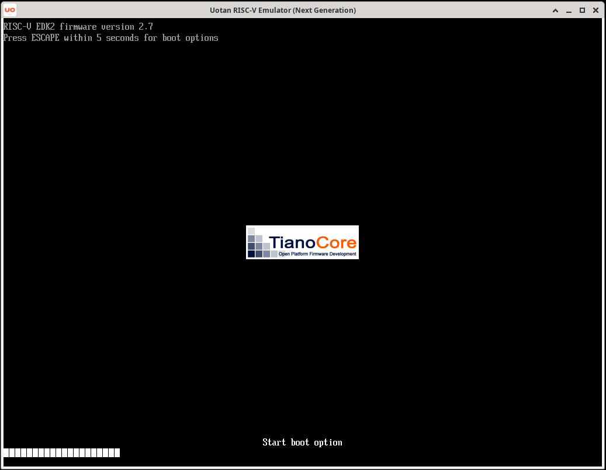
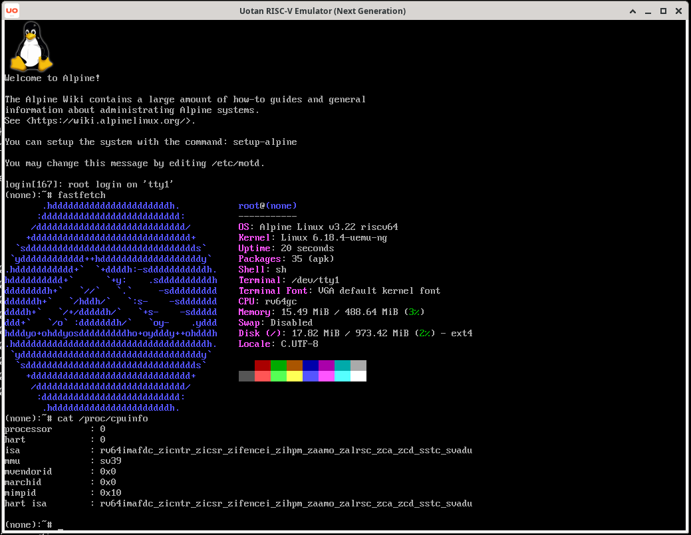
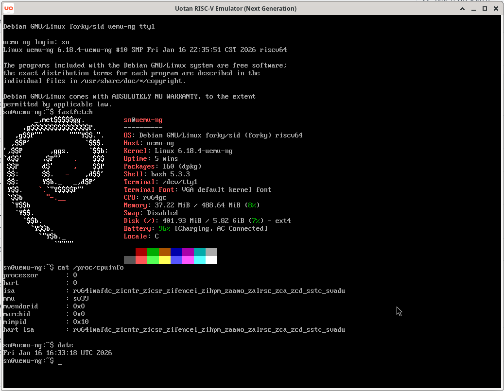
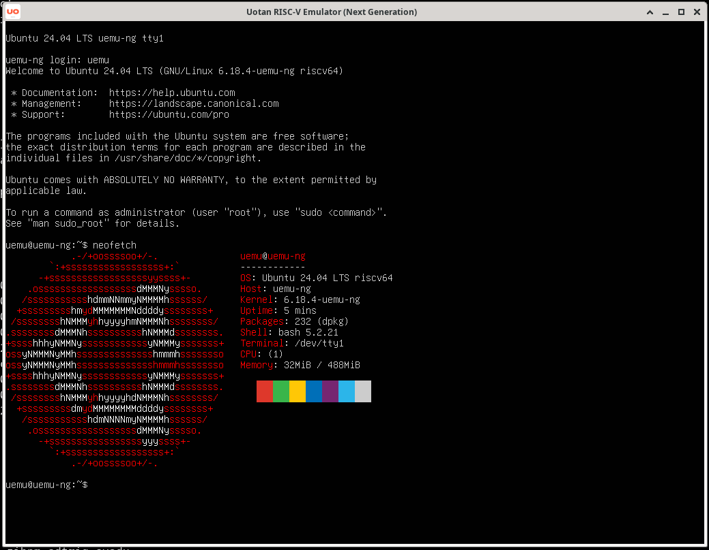

# uemu-ng — tiny RISC-V system emulator

**Uotan RISC-V Emulator - Next Generation** (*uemu-ng*) is a small rv64gc system emulator. It is a refactored version of [uemu](https://github.com/Uotan-Dev/uotan_riscv_emu). While **uemu** served as a proof-of-concept, the **NG** version focuses on strict architectural compliance and robust device emulation.




**uemu-ng** supports the following RISC-V ISA features:
* RV64I base ISAs, v2.1
* Zifencei extension, v2.0
* Zicsr extension, v2.0
* Zicntr extension, v2.0
* M extension, v2.0
* A extension, v2.1
* F extension, v2.2
* D extension, v2.2
* C extension, v2.0
* Svadu extension, v1.0
* Svade extension, v1.0
* Zca extension, v1.0
* Zcd extension, v1.0

**uemu-ng** includes the following memory-mapped devices:

| Device | Address Range | Description |
|--------|---------------|-------------|
| CLINT | 0x2000000-0x200ffff | Core Local Interruptor |
| PLIC | 0xc000000-0xcffffff | Platform-Level Interrupt Controller |
| SiFiveTest | 0x100000-0x100fff | Test device for shutdown/reboot |
| NS16550 UART | 0x10000000-0x100000ff | Serial console |
| SimpleFB | 0x50000000-0x502fffff | Framebuffer (3MB, 1024x768) |
| VirtIO-Block | 0x10001000-0x10001fff | Block device interface |
| pflash-cfi01 | 0x20000000-0x23ffffff | CFI parallel flash with Intel command set |
| GoldfishEvents | 0x10002000-0x10002fff | Input event device |
| GoldfishRTC | 0x10000100-0x100001ff | Real-time clock |
| GoldfishBattery | 0x10003000-0x10003fff | Battery status |
| BCM2835Rng | 0x10004000-0x1000400f | Random number generator |
| NemuConsole | 0x10008000-0x10008007 | Debug console from [NEMU](https://github.com/NJU-ProjectN/nemu) |

## Continuous Integration Status

| Status (main) | Description |
| :-----------: | :---------: |
| [](https://github.com/Uotan-Dev/uotan_riscv_emu-ng/actions/workflows/ci.yml?query=branch%3Amain) | Build and Test |


## Boot Demo

### [Alpine Linux v3.22](https://www.alpinelinux.org/)

### [Debian forky](https://www.debian.org/)

### [Ubuntu 24.04 LTS](https://ubuntu.com/)


## Building
### Prerequisites

* CMake 3.20 or later
* C++23 compatible compiler
* C17 compatible compiler

### Required dependencies:

* CLI11 - Command line parsing
* SFML 3 - Graphics and windowing
* `riscv64-unknown-elf-gcc`, `riscv64-unknown-elf-objcopy`, `riscv64-unknown-elf-objdump`

### Build Instructions
```bash
# Clone the repository
git clone <repository-url>
cd uemu-ng

# Initialize submodules
git submodule update --init --recursive

# Create build directory
mkdir build && cd build

# Configure and build
cmake .. -DCMAKE_BUILD_TYPE=Release
cmake --build . --config Release -j$(nproc)
```

## Usage
```
uemu-ng: RISC-V Emulator 


uemu [OPTIONS]


OPTIONS:
  -h,     --help              Print this help message and exit 
  -v,     --version           Display program version information and exit 
  -f,     --file TEXT:FILE REQUIRED 
                              ELF file to load 
  -m,     --memory UINT:INT in [64 - 16384] [512]  
                              DRAM size in MB 
  -d,     --disk TEXT         Disk file to use 
          --flash0 TEXT       Flash0 file to use 
          --flash1 TEXT       Flash1 file to use 
  -s,     --signature TEXT    Dump signature to file (for riscv-arch-test) 
  -t,     --timeout UINT [0]  Execution timeout in milliseconds (0 = no timeout) 
          --headless          Run in headless mode (no UI window) 
```

## Known Issues

* **No JIT**: It lacks Just-In-Time compilation; every instruction is fetched and decoded individually, so it is slower than **uemu**.
* ~~**EDK2/UEFI Compatibility**: The `virtio-blk` device currently cannot be successfully probed or initialized by **edk2**, making it unavailable as a boot or storage device in UEFI environments.~~

## TODO

Due to the limitation of the author's ability, 
planned and ongoing work for future versions of **uemu** includes:

* **Emulation for more devices** - mouse, GPU etc.
* **JIT compilation** — introduce a 2-Tier JIT for improved performance.

## Acknowledgments

**uemu-ng** is inspired by and benefits from a number of outstanding open-source projects, educational courses, and contributors from the systems programming community.

### Open-source Projects

This project draws design ideas, implementation references, and architectural inspiration from the following open-source emulators and system projects:

- [qemu/qemu](https://github.com/qemu/qemu)
- [NJU-ProjectN/nemu](https://github.com/NJU-ProjectN/nemu)
- [sysprog21/rv32emu](https://github.com/sysprog21/rv32emu)
- [snnbyyds/semu](https://github.com/snnbyyds/semu)
- [bane9/rv64gc-emu](https://github.com/bane9/rv64gc-emu)

### Courses and Educational Resources

Special thanks to:

- [@cocowhy1013](https://github.com/cocowhy1013)
- [@jiangyy](https://github.com/jiangyy)
- [@sashimi-yzh](https://github.com/sashimi-yzh)

for their course  
[*Introduction to Computer Systems*](https://nju-projectn.github.io/ics-pa-gitbook/).

### Contributions and Support

- [@Lu-1-Ning](https://github.com/Lu-1-Ning) — for code review and valuable feedback.
- [Wuhan Youtan Network Technology Co., Ltd.](https://www.uotan.cn/) — for providing support during the development of this project.

## License

Copyright 2025-2026 Nuo Shen, Nanjing University

Copyright 2026 UOTAN

Licensed under the Apache License, Version 2.0 (the "License"); you may not use this file except in compliance with the License. You may obtain a copy of the License at

    http://www.apache.org/licenses/LICENSE-2.0

Unless required by applicable law or agreed to in writing, software distributed under the License is distributed on an "AS IS" BASIS, WITHOUT WARRANTIES OR CONDITIONS OF ANY KIND, either express or implied. See the [LICENSE](LICENSE) file for the specific language governing permissions and limitations under the License.
